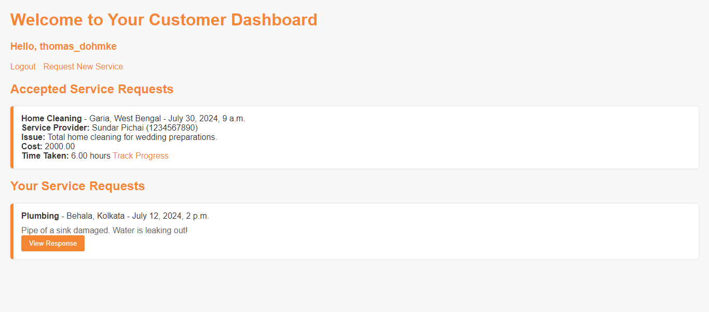
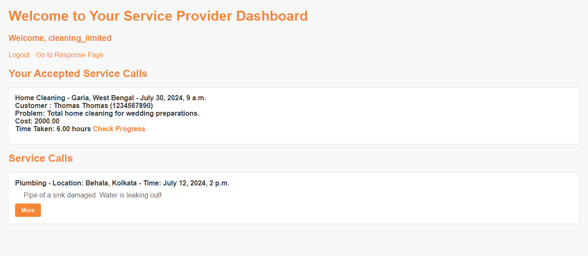

# ANYTHING Service Call Management System

## Overview

The ANYTHING Service Call Management System is a web application built using Django that allows customers to create service requests and service providers to respond to these requests. The system facilitates efficient communication and service tracking between customers and service providers.

## Table of Contents

- [Overview](#overview)
- [Features](#features)
- [Installation](#installation)
- [Usage](#usage)
- [Screenshots](#screenshots)
- [Contributing](#contributing)
- [License](#license)

## Features

- **User Authentication:**
  - Customers and Service Providers can register and log in.
  - Secure password management.

- **Customer Dashboard:**
  - Create new service calls.
  - View and track the status of service calls.
  - View responses from service providers and accept the best offer.

- **Service Provider Dashboard:**
  - View service calls based on location and category.
  - Respond to service calls with estimated cost and time.
  - Track the progress of accepted service calls.

- **Service Tracking:**
  - Customers can track the progress of their service requests.
  - Service Providers can update the status of the service calls.


## Installation

1. Clone the repository:
    ```bash
    git clone https://github.com/your-username/ANYTHING.git
    cd ANYTHING
    ```

2. Create a virtual environment and activate it:
    ```bash
    python -m venv venv
    source venv/bin/activate  # On Windows use `venv\Scripts\activate`
    ```

3. Install the required packages:
    ```bash
    pip install -r requirements.txt
    ```

4. Apply migrations:
    ```bash
    python manage.py migrate
    ```

5. Create a superuser:
    ```bash
    python manage.py createsuperuser
    ```

6. Run the development server:
    ```bash
    python manage.py runserver
    ```

## Usage

- Open your web browser and go to `http://127.0.0.1:8000/`.
- Log in with the superuser credentials created during installation.
- Create new service calls as a customer.
- Respond to service calls as a service provider.
- Track the progress and status of service calls.

## Screenshots

### Customer Dashboard


### Service Provider Dashboard


## Contributing

Contributions are welcome! Please read the [contributing guidelines](CONTRIBUTING.md) before getting started.

## License

This project is licensed under the MIT License - see the [LICENSE](LICENSE) file for details.


